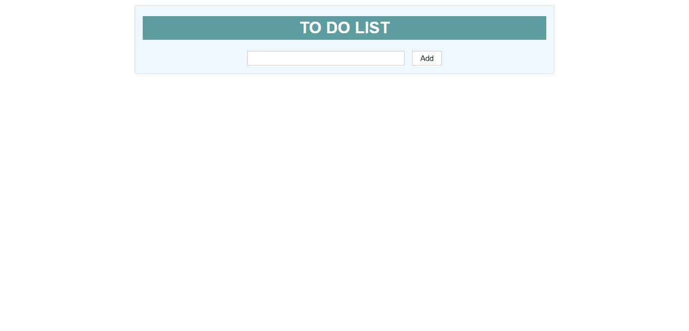
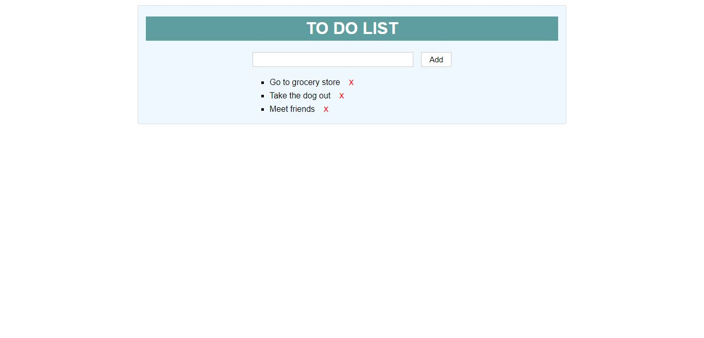

# toDoApp
This is a school assignment that I did in the summer of 2020. In to do app user can add tasks and delete them when they are done. This project is not done yet and I am planning to develope it more and add new features to it.

You can visit the application [here](https://jennilehtonen.github.io/toDoApp/).

|Table of contents|
|:------------- |
|1. [Technical solutions of the application](#Technical-solutions-of-the-application)|
|2. [Pictures of the user interface](#Pictures-of-the-user-interface)|

## Technical solutions of the application
Used technologies: **HTML, CSS, JavaScript and jQuery.**

I have developed this application a bit more after the summer: I have added a feature that saves the tasks to user's **local storage** so the tasks will stay in the application even though the user closes the browser. I have also added a feature that enables the user to just press "enter" after writing the task into the input field so it is not necessary to use mouse and click the "Add" button. In addition to these I have changed CSS stylings a bit and translated app into English. I have mainly used jQuery in the codes because it was the purpose in my school assignment.

## Pictures of the user interface

Here is the application before the user has added any tasks to it.

Here is the application to which the user has added some tasks.

